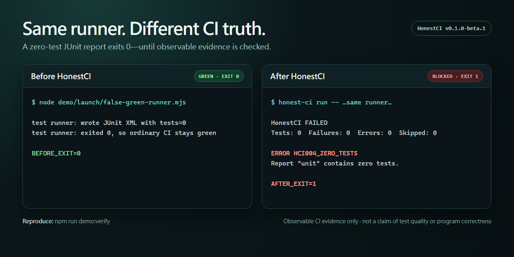

# HonestCI

[English](README.md) · [繁體中文](README.zh-TW.md) · [简体中文](README.zh-CN.md) · [日本語](README.ja.md)

[](https://github.com/f0909172434/honest-ci/actions/workflows/ci.yml)
[](https://www.npmjs.com/package/honest-ci)
[](LICENSE)
[Security policy](SECURITY.md)

**Make green CI mean the tests you expected actually ran.**

HonestCI wraps a test command, verifies fresh JUnit XML evidence, compares the
observed test count with a trusted default-branch baseline, and warns about
suspicious GitHub Actions patterns.



The [reproducible demo](launch/DEMO.md) uses the same zero-test runner twice:
it exits successfully on its own, then HonestCI blocks it with
`HCI004_ZERO_TESTS`.

```text
Ordinary runner:  npm test || true                 -> green
With HonestCI:    missing, stale, or empty JUnit   -> finding -> blocked
```

HonestCI complements test reporters. A reporter makes results readable;
HonestCI checks whether the expected evidence is fresh and whether the observed
test count still matches a trusted baseline. You can use both in the same job.

Release status: `v1.0.1`. Stable 1.x interfaces are additive. Use immutable
`v1.0.1` for reproducibility; the moving `v1` Action tag follows the latest
compatible 1.x release.

## Five-minute Quick Start

First configure your test runner to write JUnit XML. Then add `honest-ci.yml`:

```yaml
version: 1
reports:
  - name: unit
    paths: [reports/junit*.xml]
    format: junit
    min_tests: 1
    max_drop_percent: 10
    max_skipped_percent: null
baseline:
  file: .honest-ci/baseline.json
  source: default-branch
workflows:
  paths: [.github/workflows/*.yml]
```

Add the Action after checkout and dependency installation. Replace the example
command with the JUnit command for your runner:

```yaml
- uses: f0909172434/honest-ci@v1.0.1
  with:
    command: npm test -- --reporter=junit --outputFile=reports/junit.xml
    config: honest-ci.yml
    github-token: ${{ github.token }}
    evidence-output: .honest-ci/evidence.json
```

The Action needs only `contents: read`. It writes annotations and a Job Summary
and does not comment on pull requests.

After a successful default-branch run, create and review the baseline:

```console
npm install --save-dev honest-ci@1.0.1
npx honest-ci baseline write --config honest-ci.yml -- npm test -- --reporter=junit --outputFile=reports/junit.xml
git add .honest-ci/baseline.json
git commit -m "Add HonestCI baseline"
```

Runner-specific JUnit commands are available for
[Vitest, Jest, pytest, and Maven](docs/RUNNER_RECIPES.md).

## What it catches

Definite, observable problems fail the run:

- the wrapped command returned nonzero;
- a required report is missing, malformed, unsafe, or unchanged;
- zero tests ran, the configured minimum was missed, or failures/errors exist;
- the test count fell beyond the committed baseline threshold; or
- the skipped ratio exceeded an explicitly configured limit.

Heuristics remain warnings, including `continue-on-error: true`, `|| true`,
forced `exit 0`, Jest/Vitest `--passWithNoTests`, and dynamic conditions that
may skip a test-like job or step. See the stable [finding codes](docs/FINDINGS.md).

## When to use HonestCI

Use it when a GitHub Actions job already produces JUnit XML and a green run
should be backed by observable execution evidence. It is especially useful
when test counts should not silently drop on a pull request.

HonestCI is not the right tool for coverage analysis, flaky-test analytics,
hosted dashboards, GitLab/CircleCI workflows, or proving that assertions are
meaningful. Those remain explicit non-goals in 1.x.

## CLI

HonestCI requires Node.js 20 or newer.

```console
npm install --save-dev honest-ci@1.0.1
npx honest-ci lint
npx honest-ci run --config honest-ci.yml --evidence-output .honest-ci/evidence.json -- npm test
npx honest-ci check --config honest-ci.yml
npx honest-ci baseline write --config honest-ci.yml -- npm test
```

Use `--format pretty` for people or `--format json` for automation. Exit status
is 0 for pass, 1 for definite findings, and 2 for invalid input or configuration.
Passing a test command to `baseline write` is recommended: HonestCI writes the
baseline only when the command succeeds and the configured reports are fresh.
The command remains optional for compatibility, but existing reports then carry
`HCI107_FRESHNESS_UNVERIFIED`.

## Evidence Bundle v1

`run` and `check` accept `--evidence-output <relative-path>`. The GitHub Action
accepts the same input and returns `evidence-path`. Upload remains an explicit
workflow choice:

```yaml
- name: Upload HonestCI evidence
  if: always()
  uses: actions/upload-artifact@043fb46d1a93c77aae656e7c1c64a875d1fc6a0a # v7
  with:
    name: honest-ci-evidence
    path: .honest-ci/evidence.json
```

The bundle contains the result, hashes of the configuration/report/baseline/
workflow, and allowlisted GitHub provenance. It contains no raw JUnit, test
names, logs, arbitrary environment variables, or secrets. Hashes preserve
observed bytes; they do not prove runner authenticity, test quality, or
correctness. See [Evidence Bundle v1](docs/EVIDENCE_BUNDLES.md).

## Reproduce the false-green check

```console
npm ci
npm run build
npm run demo:verify
node dist/cli/index.js check --config demo/healthy/honest-ci.yml
```

The demo proves that the fixture is detected; it does not prove that HonestCI
finds every possible CI defect.

## Trusted baselines

On a pull request, the Action fetches `.honest-ci/baseline.json` from the base
commit through the GitHub API. A pull request cannot lower its own comparison
target by editing the workspace copy. If a fork cannot fetch the baseline,
HonestCI keeps its fixed minimum checks and emits
`HCI106_BASELINE_UNAVAILABLE`.

## Scope and documentation

HonestCI v1 supports GitHub Actions and JUnit XML on Ubuntu, Windows, and
macOS. It does not execute workflow YAML, provide a hosted service, analyze
coverage, support GitLab/CircleCI/TRX, call an AI API, or post pull request
comments.

HonestCI verifies observable CI execution evidence. It does not prove that
tests are sufficient, that assertions are meaningful, that all desired tests
exist, or that a program is correct.

[Configuration](docs/CONFIGURATION.md) ·
[Runner recipes](docs/RUNNER_RECIPES.md) ·
[Release policy](docs/RELEASE_POLICY.md) ·
[Security](SECURITY.md) ·
[Threat model](docs/THREAT_MODEL.md) ·
[Contributing](CONTRIBUTING.md)

MIT License.
